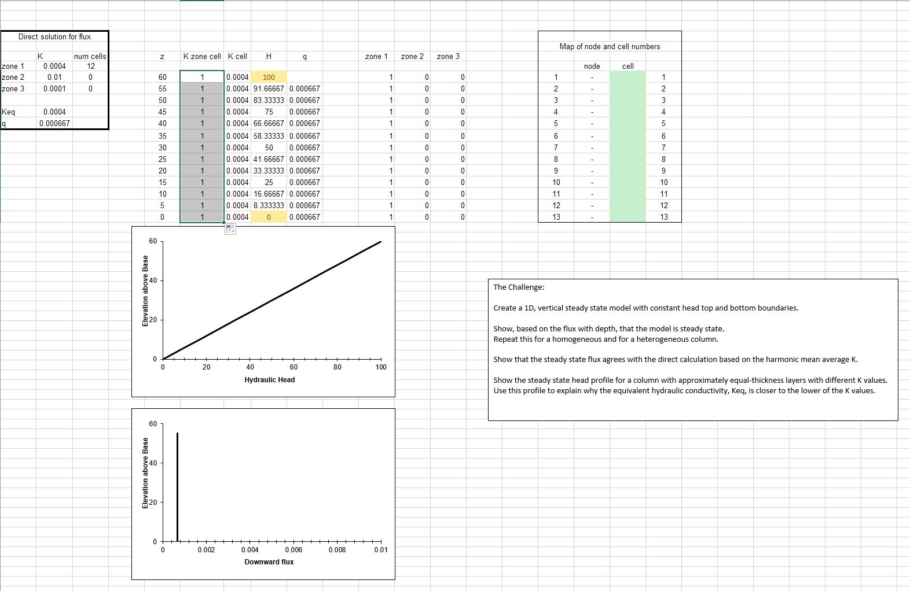
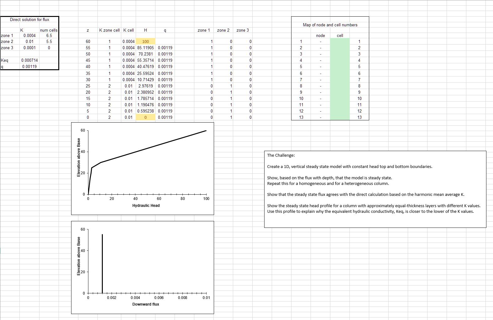

# Box Model- Excel Exercise

An excel sheet is supplied that can model steady state saturated flow through a layered (or homogeneous) 1D vertical column with constant head top and bottom boundary conditions.   

### Model Description
​The model that you have been provided is set up for a homogeneous medium.  You will be asked to modify the K distribution to form a layered medium to answer some of the questions.  
Remember that the focus of this course is primarily to use models to improve your hydrogeologic understanding.  In other words, getting the model to run correctly is step one,
then The Challenge begins!

### The Challenge
Show, based on the flux with depth, that the model is steady state.  Repeat this for a homogeneous and for a heterogeneous column.

Show that the steady state flux agrees with the direct calculation based on the harmonic mean average K.  Write the equation defining the direct calculation of the flux.

Show the steady state head profile for a column with approximately equal-thickness layers that have different K values.  
Use the head profile to explain WHY the equivalent hydraulic conductivity, Keq, is closer to the lower of the two K values.

### Correct Key Figures

In this case, your model really should work.  One thing that might hang you up is - you have to have iterative solutions activated in Excel.  If you get a 'circular reference' error, search online for how to fix this.  If your model just bombs, shut it down without saving and reopen it.

Just to be sure that you have the right figures upon which to base your answers to The Challenge, I have included screenshots of the model with a homogeneous solution and another with a heterogeneous solution.  You do not need to use the same boundary condition or K values that I used.  In fact, I would encourage you to play around with the model a bit!

*Figure 1: Spreadsheet with a solution for a homogeneous column.*

*Figure 2: Spreadsheet with a solution for a two-layer heterogeneous column.*

### Discussion Points
**In addition to The Challenge, start thinking about the following ideas**

What are boundary conditions?  Answer this both conceptually and mathematically.

What are model parameters?  How do they (and don't they) represent the actual subsurface?

What are steady state conditions and how can they be identified from the Excel model results?

Can you imagine how the model inputs could be stored in separate files rather than other spreadsheet cells?  Describe the flow of information from a file that describes the other files that contain model-specific information about the system.

What is an iterative solution?  Can you explain it to a hydrologist who is not a modeler?  Can you describe (or imagine) how Excel finds the solution?

What is a direct solution?  What are its (dis)advantages compared to an iterative (numerical) solution?
