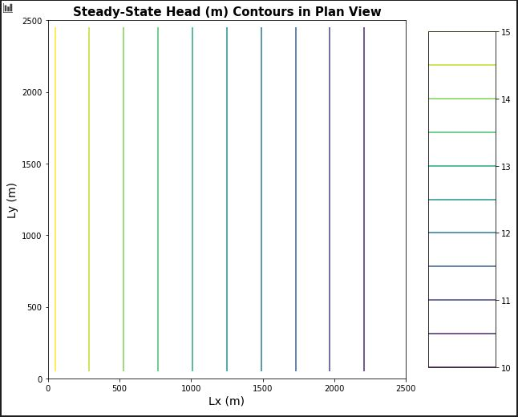
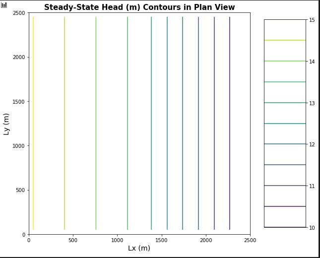
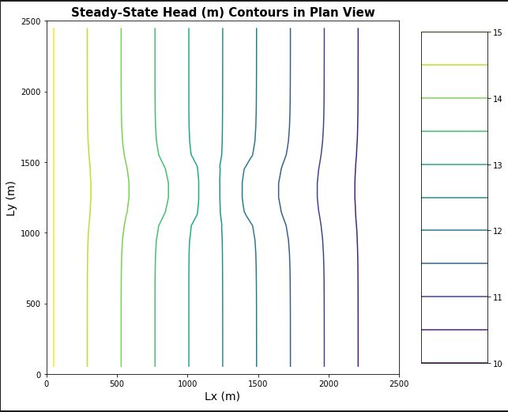

# Box Model- Hand-Built MODFLOW

MODFLOW files have been supplied that model steady state saturated flow through a 3D system.  The layers are flat lying.  The top and bottom faces and two opposite vertical boundaries are no-flow.  Each of the other two faces has a constant head applied to each.

To run a MODFLOW model from the command line, do the following.
For now, copy mf2005.exe into the directory with your MODFLOW input files.
Open a command window and navigate to the directory with your MODFLOW input files.  (cd is the command to change directories)
Type mf2005 BoxModel_Manual and hit enter.  This should run MODFLOW and overwrite your output files.

### Model Description
​The model that you have been provided is set up for a homogeneous medium.  You will have to change the K distribution to replicate the Excel exercise, but for horizontal flow rather than vertical.  You can do this using a text editor to change values in the .bcf file.  But, be careful, the spacing matters!  The Challenge begins!!

### The Challenge
Show, based on the flux with horizontal distance from a constant head boundary, that the model is steady state.  Repeat this for a homogeneous and for a heterogeneous column for which zones of different K are placed in series with the direction of flow.  Note that the best way to do this is to take the values from the .list file into Excel, combine them with the K values from the .bcf file, and calculate the flux at each point.  Keep in mind that heads are calculated at the center of a cell (a node) and the K values are defined over each cell.

Show the steady state head contour in plan view for the heterogeneous (zones in series) condition.  Use this plot to defend a contention that flow is 1D.  Then, drawing on your Excel assignment, use the results to explain WHY the equivalent hydraulic conductivity, Keq, is closer to the lower of the two K values.

Build a model based on a homogeneous domain with a square region of lower K in the middle of the domain.  What can you learn based on your explanation of what controls the effective K for a 1D flow system now that you are applying it to a 2D system?  What do you think the Keq of this entire system would be compared to the high and low K values?  Explain why it is much more difficult to develop a direct solution for this 2D system than it was for a 1D system (including the zones placed in series).  

### Correct Key Figures

Just to be sure that you have the right figures upon which to base your answers to The Challenge, I have included screenshots of three figures.  The first shows the head distribution (in 2D, plan view) for a homogeneous system.  The second shows the distribution for a heterogeneous system.  The final shows the distribution for the final heterogeneous system - homogeneous with an inclusion.  As for the first assignment (Excel), you can use different head boundary values and K values.  Again, I would encourage you to do so to improve your intuition!

*Figure 1: Steady state head distribution produced by a MODFLOW model of a homogeneous domain.*

*Figure 2: Steady state head distribution produced by a MODFLOW model of a zoned, heterogeneous domain.  Left half has K = 1 m/d, right half has K = 0.5 m/d*

*Figure 3: Steady state head distribution produced by a MODFLOW model of a homogeneous domain with a low K inclusion.  The inclusion is in columns 11-15 and rows 11-15, inclusive.  The background has a K of 1 m/d and the inclusion 0.5 m/d.*

### Discussion Points
**In addition to The Challenge, start thinking about the following ideas**

What is MODFLOW?  What is a MODFLOW?  What is a MODFLOW package?  What is a MODFLOW input package?

What is meant by model dimensionality?

Why might parameters be defined in zones?

If you want to establish purely horizontal flow, what (specifically) should be defined as constant along the constant head boundaries?

What is an equipotential?  Assuming that the medium is isotropic (why?) and that flow is horizontal, how can you track the path of a water particle through the domain?

For steady state conditions, there are equivalent Type I and Type II boundary conditions.  What would the Type II boundary condition be that would result in the same equipotentials for the first model?  What is the value of the constant flux?  What about the second model?  What are the values of the constant flux on the left and right boundaries?  What is fundamentally different about the equivalent Type II boundary for the third model compared to the first two?
