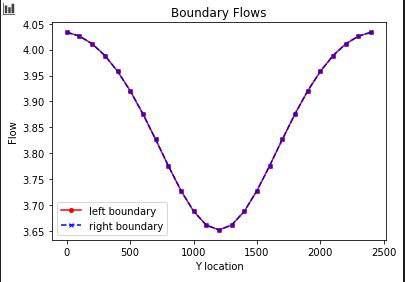
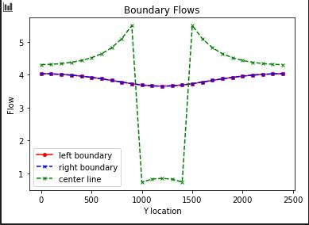
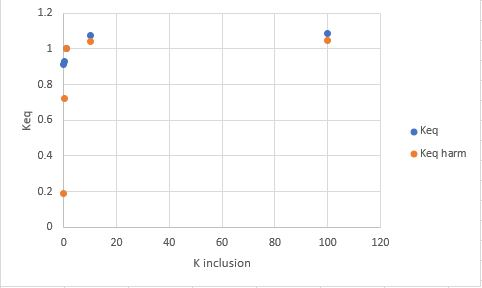
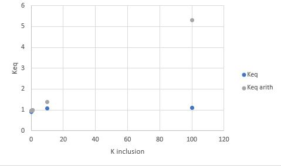

# Box Model- flopy Exercise

A flopy code is provided to you that recreates the 2D, heterogeneous model that you created manually in MODFLOW for the last exercise.  The code creates plots that show the grid, boundary conditions, 2D K distribution, steady state boundary fluxes, and steady state heads along a profile connecting the constant head boundaries.  It also includes a plan view map that shows both equipotentials and flow vectors.  Nice, right?  The code has some modules (commented out) that you will use later.   

### Model Description
​The model that you have been provided is set up for a heterogeneous medium - a homogeneous medium with a centered, square low K inclusion.  You will be asked to modify the K value of the inclusion and discuss the impacts on the head and boundary flux distributions.  You will also be asked to assess how the domain-scale equivalent K depends on the background and inclusion K values.  

Note that you need to edit the code to tell it where to find mf2005.exe on your computer!  

Remember that the focus of this course is primarily to use models to improve your hydrogeologic understanding.  In other words, getting the model to run correctly is step one, then The Challenge begins!

### The Challenge
For the initial values of background and inclusion K, plot the flow into the left and out of the right boundary.  (The code, as provided, makes this plot for you.)  Explain why the values are not constant along the boundary (relate to the definition of a Type I boundary).  Explain why the flow distributions are the same for the left and right boundaries.

Add a plot of the left-to-right flow along a line that passes through the center of the inclusion.  What can you learn from comparing this distribution to that seen on the boundaries?

Calculate the total flow into (and out of) the domain.  Use this to calculate the Keq of the heterogeneous system with the K values as given in the starter code.  Repeat this calculation for the following K values for the inclusion (keeping the background K as it is given):  0.01, 0.1, 1, 10, 100.  Compare the Keq to the harmonic and arithmetic mean K values based on the area occupied by each medium (rather than the length for a 1D system).  Can you draw any general conclusions about the impact of high or low K heterogeneities on the equivalent K for the flow system examined?

Does the equipotential distribution depend on the absolute or relative K values for the background and the inclusion?  How would you use the model to test your answer?

### Correct Key Figures

In this case, your model really should work.  One thing that might hang you up is - you have to have iterative solutions activated in Excel.  If you get a 'circular reference' error, search online for how to fix this.  If your model just bombs, shut it down without saving and reopen it.

Just to be sure that you have the right figures upon which to base your answers to The Challenge, I have included screenshots of the model with a homogeneous solution and another with a heterogeneous solution.  You do not need to use the same boundary condition or K values that I used.  In fact, I would encourage you to play around with the model a bit!

*Figure 1: Base case boundary fluxes.*

*Figure 2: Base case boundary fluxes and flux through midline of domain.*

*Figure 3: Comparing 2D Keq with the area-weighted harmonic mean K.*

*Figure 4: Comparing 2D Keq with the area-weighted arithmetic mean K.*

### Discussion Points
**In addition to The Challenge, start thinking about the following ideas**

What are the implications for your results for representing K in a model cell, given that the distribution of K is always heterogeneous at the small scale?

Discuss what it means to say that, for steady state flow, there are equivalent Type I and Type II boundary conditions.  How might this be useful in practice?

How could you (or did you) use looping to answer The Challenge more efficiently?

What are some advantages (easy) and disadvantages (harder) of using flopy rather than building MODFLOW models manually?
