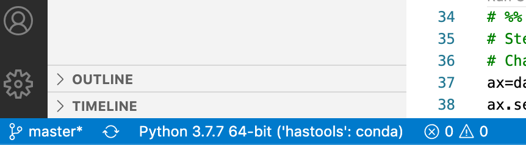

# Software Setup Instructions for Groundwater Modeling Spring 2021

This semester we will be working with the following software programs. Everyone will need to have these programs setup on whatever computer(s) you are planning on using for the course.  The programs with a * are optional but highly recommended. Follow the setup instructions below to get everything installed.

- Github: This is where  course materials will be stored and where you will access your homework assignments.
- Gitkraken*: This is a tool to help you manage local clones of GitHub repos.
- Python 3: We will be running MODFLOW models using Python with a package called FloPY
- VsCode*: A tool for editing and running Python Scripts
- Jupyter: A python package for working with Jupyter notebooks.
- MODFLOW: the groundwater model we will be using.
____
## Table of Contents:
1. [ GitHub](#github)
1. [ GitKraken](#gitkraken)
1. [ Repo Cloning](#repo)
1. [ Homework Setup](#classroom)
1. [ Miniconda](#conda)
1. [ Enviroment](#environment)
1. [ Packages](#packages)
1. [ MODFLOW](#modflow)
1. [ Software Install Debugging tips](#debug)
1. [ Tutorials](#"tutorials")
1. [ Optional VSCode Install](#vscode)


____

<a name="setup"></a>
## Setup Instructions
<a name="githubinst"></a>
___
<a name="github"></a>
#### 1. Setup account and install Github
  - Register for account on GitHub: <https://github.com/>
  - Check if you have GitHub installed and if not install it.  Directions for both Windows & Mac [here](http://happygitwithr.com/install-git.html). Windows users should follow Option 1 in 6.2. Mac users can follow Option 1 in 6.3.
  - *Note:* If you are a Windows user make sure you also install [GitBash](https://www.atlassian.com/git/tutorials/git-bash) as is noted in the instructions.
  - Setup options in Git. If you have a Mac, you can go to the terminal (Applications -> Utilities -> Terminal) as shown above. If you have a Windows, open Git BASH, which you should have downloaded.  You will need to  setup you [username](https://help.github.com/en/github/using-git/setting-your-username-in-git) and your [email](https://help.github.com/en/github/setting-up-and-managing-your-github-user-account/setting-your-commit-email-address)
  - Generate a SSH key so you don’t need to enter your password every time you interact with GitHub. Instructions for this can be found [here](https://help.github.com/en/github/authenticating-to-github/adding-a-new-ssh-key-to-your-github-account).

___
<a name="gitkraken"></a>
#### 2.	Install **Git Kraken**
- This is a handy GUI for working with Git Repos that is basically an improvement over GitDesktop. You can get it [here](https://www.gitkraken.com/). No need to worry about boards or timelines for now you can just install the GUI.
- You can also get a free upgrade to Git Kraken pro as a student if you go [here](https://education.github.compack?utm_source=github+gitkraken). This will let you work with private as  well as public repos using Git Kraken.

___
<a name="repo"></a>
#### 3. Clone the course repo
I recommend you start by creating a directory for this class where you will keep all of your repos.
- *GitKraken Approach*
  - Open GitKraken and select `file/clone repo`
  - The `clone with url` option should automatically be selected on the left
  - For `where to clone to` browse to the folder you created for this class
  - For the URL you will need to go to the GitHub website to get the URL.
    - Go to the Course Materials Repo on the [GitHub organization](https://github.com/GW-modelling-Spring2021/Course_Materials) for this course and click on the green 'code' button
    - Make sure it says “Clone with SSH” in bold in the top left of the pop-up box. If not, click on the blue “Use SSH”
    - Click the clipboard button next to the address in the box to copy this to your clipboard
    - Paste the URL into the `URL` box on `GitKraken`
    - Select `clone repo`
    - Confirm that the folder was put in the location you wanted you should be able to open it up in your  finder or file explorer and see it there now.

- *Command Line Approach*
    - Make a directory for this class wherever you would like to have it on your computer
    - Open a terminal window and navigate to your course directory (you can do this using the commands cd and pwd)
    - Clone the main course materials repo: `git clone [ADD SSH]`
    - *if your ssh keys aren't setup you can also clone it like this* `git clone [ADD LINK]`

___
<a name="classroom"></a>
#### 4.  Homework and GitHub Classroom
1. Click on the following link to create your personal homework repo: (link to be provided in the first class ... someone remind me, please!) 

2. Make a local clone of your homework repo the same way you did with the course repo. You can refer back to the GitKraken approach instructions from **Step 3** just make make sure that you use the URL for your course homework repo this time and not the main course materials repo again.
      *Note:* If you received an error in the above steps, you may have to clone with HTTPS instead of SSH. You can do this by again clicking on the "Clone or Download" button in the repository page, then clicking "Use HTTPS" in the top right of the pop-up box. Now copy the link and repeat this step.

___
<a name="conda"></a>
#### 5. Install Miniconda
- Download and install the correct version of mini conda for your operating system. You can find all the options [here](https://docs.conda.io/en/latest/miniconda.html). Make sure you **pick the Python3.x not Python2.x version** for your system. Follow the prompts to instalThe default options should be fine.
- Once you have done this you should be able to check you have it installed by typing `conda info` from command line. If it worked you should see all the info for what you just installed.
- If you get a message saying "command not found" when you type `conda info` then you will need to do the following additional steps:
  - open a new git bash window and type `vi .bash_profile`
  - You have now opened a file called ".bash_profile" in the program *vi*. To start edit this file type `i` you will see at the bottom of the screen that it is in insert mode now'
  - now type the following line into your file replacing the 'username' with whatever your user name is on your computer:
  ```
  export PATH="/c/Users/username/miniconda3/Scripts:$PATH"
  ```
  - Once you have typed this line hit the **escape** button to exit insert mode
  - Now hold down the **shift** key and type `zz` to exit and save your changes
  - To be sure you did it right you can `vi .bash_profile` again and you should see the line you added there. To quit without saving type `:q!`
  - Now that we have updated our bash profile we need to source it. So from you terminal type `source .bash_profile`
  - If this worked you should no longer get a "command not found error" when you type `conda info`
  - Assuming you passed the last test you need to do one more setup step by typing `conda init bash`
  - Finally, to get this last step to take effect, you will need to **close your current git bash window and open an new one**.
  - Fingers crossed... this should do it. You can now proceed to the next step!

___
<a name="environment"></a>
#### 5. Make an environment for this class and activate it
 - Next we will create a python environment for this class. You can follow along directly withe commands I have outlined below. For more details you should also refer to this [Quick environment setup workflow](https://uoa-eresearch.github.io/eresearch-cookbook/recipe/2014/20/conda/) or this [more detailed user-guide for managing environments](https://docs.conda.projects/conda/en/latest/user-guide/tasks/manage-environments.html).
  ```
  conda create --name gwmod python=3.8
  conda activate gwmod
  ```

  If this was successful you should see 'hastools' in your list of environments if you type
  ```
  conda env list
  ```
  Finally you will want to activate your environment by typing
  ```
  conda activate gwmod
  ```
  You should now see the environment name 'gwmod' at the start of your command line promt and if you type `conda env list` again you will see that this is the active environment.

___
<a name="packages"></a>
#### 6.	Install Packages
After you have setup your environment you will need to add modules to it.

- First open a terminal window (terminal for mac or Command Prompt for windows).
```
conda activate gwmod
```
- Then you will need to install the following packages
- To install you should run the following command from your terminal window:
```
conda install modulename
```
Where *modulename* is the name of the module from the list below:
    - pip
    - jupyter
    - numpy
    - requests
    - matplotlib
    - Pandas
- Flopy has to be installed with pip not conda so finally run the following:
```
pip install flopy
```
- To check if you have installed these modules you can use the command
```
conda list
```

___
<a name="modflow"></a>
#### 7.	**Install MODFLOW**
**Mac Users:**
  Run the following commands to install MODFLOW using the PyMake
- Check if you have gfortran installed bu typing `which gfortran` or `gfortran -v` into command line. If you don't see that you have gfortran installed you should install it from [here](https://github.com/fxcoudert/gfortran-for-macOS/releases)
- `cd` to a directory where you would like to put your MODFLOW builds
```
Pip install https://github.com/modflowpy/pymake/zipball/master
git clone https://github.com/modflowpy/pymake
cd pymake/examples
python make_mf2005.py
python make_mp7.py
```
- The mp7 and mf2005 folders created in this step have the mode executables that you will need to point to when you are running MODFLOW. If you want to move these somewhere else you can do so now.

**PC Users:**
  - Follow [these install instructions](https://water.usgs.gov/ogw/modflow-nwt/MODFLOW-NWT-Guide/index.html?beginners_guide_to_modflow.htm)
  - You can download MODFLOW 2005 [here](https://www.usgs.gov/software/modflow-2005-usgs-three-dimensional-finite-difference-ground-water-model).

  ____
  <a name="debug"></a>
  ### Software Install Debugging tips
  This is a running list of common issues and fixes if you run into issues please report them so we can add to this LIST

  ### Jupyter Notebooks:
  - Issue with python code blocks not running: It turns out the kernels were not starting. Turns out ipykernel needed to be updated (now 5.1.4) for the new Notebook version (6.03) which was updated to work with Python (3.8).The latest ipykernel can be cloned from here - https://github.com/ipython/ipykernel.
  - Problem Exporting PDFs:  When creating the pdf, go to the location of the file in your terminal and enter the following:
    1. export PATH=/Library/TeX/texbin:$PATH
    2. jupyter nbconvert your_notebook.ipynb --to pdf

     Here is the [Link for the stack overflow description](https://stackoverflow.com/questions/52300242/solving-500-internal-server-error-nbconvert-failed-xelatex-not-found-in-path)

  ### Mac Flopy install:
  - If you get an error about missing .h files it could be that your headers are not installed. You can fix that following [these instructions](https://donatstudios.com/MojaveMissingHeaderFiles).
  - also check that you have a recent version of  gfortran installed and reinstall if  needed per the first step in the instruction

____
<a name="tutorials"></a>
## Helpful Links and Tutorials for other tools
- **Command Line** Note that as long as Windows users are using Git Bash the commands will be the same for them as Mac users. If Windows users use PowerShell instead some of the commands will be different.
  - [Unix Workbench - Command Line Basics (Mac Termina and Git Bash)](https://seankross.com/the-unix-workbench/command-line-basics.html#summary)
  - [Command Line Crash Course (Windows and Mac)](https://learnpythonthehardway.org/book/appendixa.html)
  - [Mac, WindowsComparison](https://arian-celina.com/windows-cmd-macos-terminal-navigation/#:~:text=The%20CMD%2FTerminal%20window&text=Home%20folder%20is%20the%20usual,name%20of%20the%20current%20folder)

- **GitHub**
  - [Intro to GitHub Tutorial](https://product.hubspot.com/blog/git-andgithub-tutorial-for-beginners)
  - [Another GitHub Tutorial](https://towardsdatascience.com/gettingstarted-with-git-and-github-6fcd0f2d4ac6)
  - [Github training game](https://learngitbranching.js.org/)

- **Atom**
  - [Getting started](https://flight-manual.atom.io/getting-startedsections/atom-basics/)
  - [Installing packages](https://flight-manual.atom.io/using-atomsections/atom-packages/)
  - [Adding images to Markdown](https://atom.io/packages/markdown-imageassistant)

- **Conda**
  - [Quick environment setup workflow](https://uoa-eresearch.github.io/eresearch-cookbook/recipe/2014/11/20/conda/)
  - [Detailed user-guide for managing environments](https://docs.conda.io/projects/conda/en/latest/user-guide/tasks/manage-environments.html)

- **VS code**
  - [Basics of coding in VS code](https://code.visualstudio.com/docs/editor/codebasics)
  - [Tips and tricks for working in VS code](https://code.visualstudio.com/docs/getstarted/tips-and-tricks)
  - [Working with GitHub in VS code](https://code.visualstudio.com/docs/editor/github)
  - [Using terminal in VS code](https://code.visualstudio.com/docs/editor/integrated-terminal)
  - [Python environments in VS code](https://code.visualstudio.com/docs/python/environments)

- **Jupyter**
    - [Jupyter Tutorial](https://www.dataquest.io/blog/jupyter-notebook-tutorial/)

- **Markdown**
  - [Markdown Cheatsheet](https://github.com/adam-p/markdown-here/wiki/Markdown-Cheatsheet)
  -[Another Longer Markdown Cheatsheet](https://github.com/adam-p/markdown-here/wiki/Markdown-Cheatsheet#emphasis)


____
<a name="vscode"></a>
### Optional VSCode install Instructions
You will be fine using Jupyter notebooks for the semester but if you prefer to have a more interactive development environment we recommend Visual Studio Code, called VS Code for short. These instructions will help you set it up
- **Mac users:**
  - Use this [link](https://code.visualstudio.com/) or just google 'vs code'. Click on *Download for Mac Stable Build*
  - Go to your Downloads folder and click on *VSCode-darwin-stable.zip*. Click and drag the Visual Studio code.app application into your Applications folder.
  - Open the application and make sure you can see the 'Welcome' and 'Untitled' tabs.
    - *Note:*A dialogue box might pop up stating that it’s an application downloaded from the internet, asking if you want to open it. Click Open.

- **Windows users:**
  - Use this [link](https://code.visualstudio.com/) or google vs code. Click on *Download for Windows Stable Build*.
  - Open the download and click the 'I accept the agreement' button.Click 'Next' and then 'Next' (let your machine choose where to put it).
  - When the *Select Addtional Tasks* window pops up, check all of the boxes before hitting 'Next.'
  - Now, you should be able to hit 'Install' and 'Finish.'
  - Open the application.

- After you have installed VS Code you will need to install the Python extension. To do this go to view > extensions on the dropdown menu and then search for 'python'. You want the main one that comes up. It looks like this:


- After you have installed VS Code you should set it to use the python environment you just made by following the instructions [here](https://code.visualstudio.com/docs/python/environments#_where-the-extension-looks-for-environments). If this is  done correctly you should see your python environment in the bottom left corner of your vs code window like this:


- It this point you should  try running a python script. When you try to run a script using Python Interactive in VSCode for the first time, you will be prompted in a dialog box to download IPyKernal.

- If you are unable to download IPyKernal, the terminal will load and report an error similar to the below (in addition to a bunch of other text):
```
conda : The term 'conda' is not recognized as the name of a cmdlet, function, script file, .....
```

  - The problem is that the default terminal in VSCode (for windows) is power shell. Power shell doesn't work well with VSCode.

  - **The solution is to change the default terminal in VSCode to 'command prompt' using the following steps:**

  1. Hit ctrl+shift+p
  2. Search for 'Terminal: Select Default Shell', and click
  3. There should be a few available, including 'bash', 'power shell', and 'command prompt'. Click on 'command prompt'
  4. Exit and re-enter VSCode for the change to stick.

  - That's it! You should be able to download IPyKernal and run your script now.

  - To further check that 'command prompt' is your default terminal:

  5. Click in the toolbar View > Terminal
  6. At the top of the terminal, you should see a drop-down menu. Listed at the very top should be '1: cmd'.
  7. You can triple check by seeing `conda` and `python` work in the command line. For example, simply type in `conda`, and you'll get back a message starting with `conda is a tool for managing and deploying applications, environments and packages.`.

  - If something went wrong, you'll find a message such as: `bash: conda: command not found`. Try to start at step 1 again.
